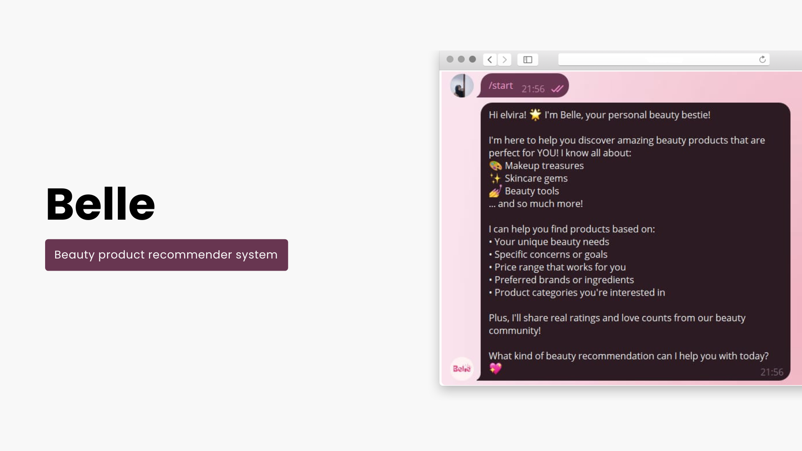

# 💄 Belle: Beauty Product Recommender System

Belle is an **LLM-based Conversational Recommender System (CRS)** designed to suggest **beauty products** based on user preferences.   The system leverages **Large Language Models** to provide personalized, conversational recommendations that feel natural and user-friendly.

---

## ✨ Features

- 🗣 **Conversational Recommendation**: Chat with Belle using natural language queries. 
- 💅 **Beauty Product Domain**: Focused on skincare, makeup, and other beauty products.  
- 🔍 **Product Understanding**: Recommends items based on product type, benefits, ingredients, and user needs.  
- 📊 **LLM Integration**: Powered by **OpenAI GPT** to enhance dialogue and personalization.  

---

## 🛠️ Tech Stack

- **Python**  
- **OpenAI GPT API**  
- **Pandas**  
- **Telegram Bot** 

---

## 💡 Interested in this project or want to collaborate?  
Feel free to reach out on [LinkedIn](https://www.linkedin.com/in/elvirawlndr)!

